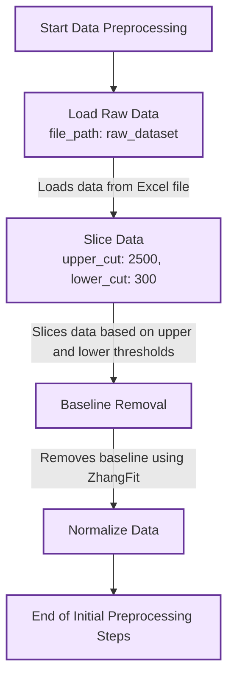
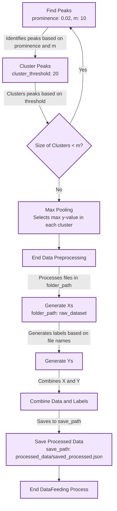
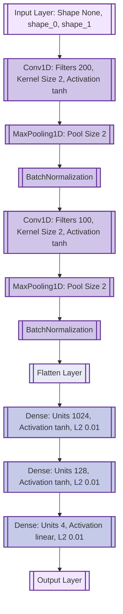

Data preprocessing pipeline

![[Pasted image 20240811121742.png]]

![[Pasted image 20240811122546.png]]

![[Pasted image 20240811123445.png]]

![[Pasted image 20240811124318.png]]

![[Pasted image 20240811131502.png]]